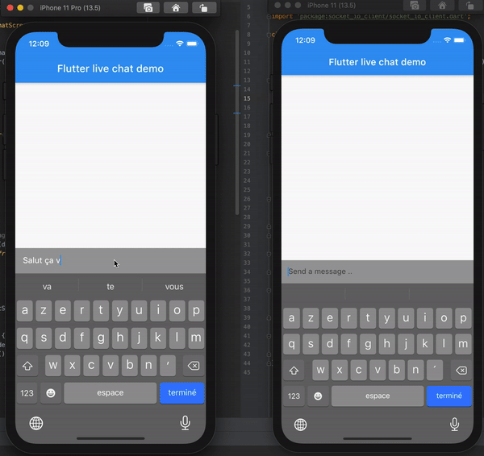

# Flutter BLoC live chat demo

This a simple approach of implementing live chat in flutter apps using [flutter_bloc](https://pub.dev/packages/flutter_bloc) package and [socket.io](https://pub.dev/packages/flutter_bloc) library.
<br/>
<br/>


## Introduction
What's in the box ? A minimal WebSocket server written in go. Inside this server we'll only handle one type of event which is `message`.
We will have a socket connexion open once our widget is called then we'll close it once we done with it.
#### Warning ⚠️

For some reasons it doesn't work on Android emulator
## Getting Started

Clone this repository

#### Installation
install dependencies
```bash
flutter pub get
```
generate files
```bash
flutter pub run build_runner build --delete-conflicting-outputs
```

## Start the server 
Launch your favorite GoLang IDE, copy the files inside the server folder, then ..
```bash
go run main.go
```

The server will run on port `:8000`
## Libraries

- [flutter_bloc](https://pub.dev/packages/flutter_bloc)
- [kiwi](https://pub.dev/packages/kiwi) 
- [socket_io_client](https://pub.dev/packages/socket_io_client) 

## Stay in touch with me 😊

e-mail: [binisoma@gmail.com](mailto:binisoma@gmail.com)
<br/>
LinkedIn: [Soma Bini](https://www.linkedin.com/in/soma-bini/)
